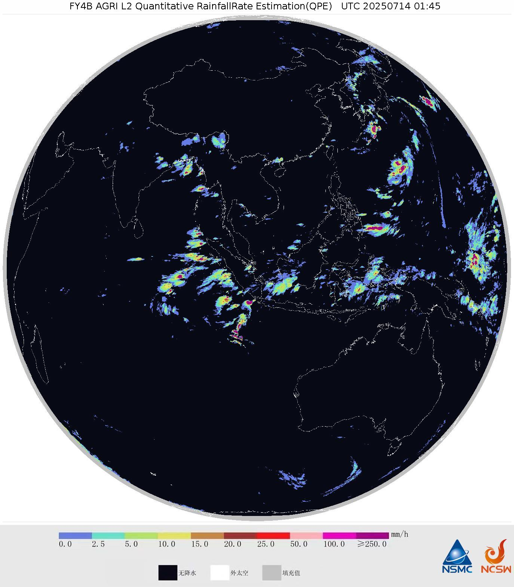
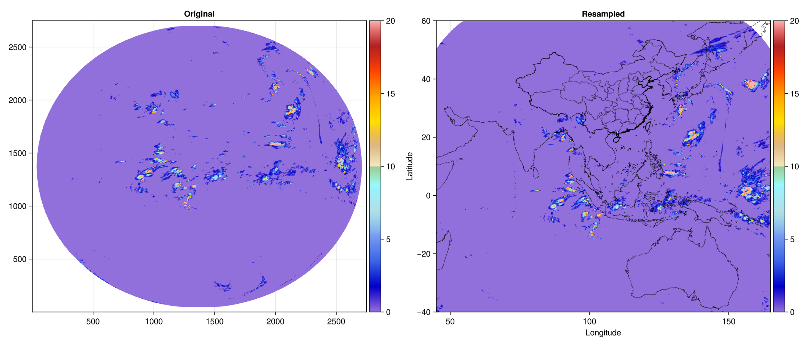

# 1 FY-4B, AGRI

## 1.1 数据
<https://satellite.nsmc.org.cn/PortalSite/Data/Satellite.aspx?SatelliteCode=FY4B&SeriesCode=FY4X&InstrumentTypeCode=AGRI&currentculture=zh-CN>

## 1.2 下载FullMask_Grid.raw文件
> 经纬度文件

<!-- <http://satellite.nsmc.org.cn/PortalSite/StaticContent/DocumentDownload.aspx?TypeID=3> -->
<https://data.nsmc.org.cn/DataPortal/cn/support/document.html?TypeID=3&ItemID=563>

## 1.3 大气矫正方法

1. 大气校正：<https://github.com/Zhaoguanhua/AtmosphericCorrection>
2. 角度矫正：<https://github.com/GERSL/Preprocessing-Tools>

# 2 卫星降水

风云4B只有一个卫星降水产品：

<https://data.nsmc.org.cn/DataPortal/cn/support/dataset.html?code=FY4B-_AGRI--_N_DISK_1330E_L2-_QPE-_MULT_NOM_YYYYMMDDhhmmss_YYYYMMDDhhmmss_4000M_V0001.NC>

> `2022-06-01` ~ present, 15min or 1hourly

<!-- <https://satellite.nsmc.org.cn/DataPortal/cn/data/dataset.html?dataCategoryCode=Atmosphere> -->

<!-- **检索过程**
<https://data.nsmc.org.cn/DataPortal/cn/data/structure.html?SeriesCode=FY4X&SatelliteCode=FY4B> -->

